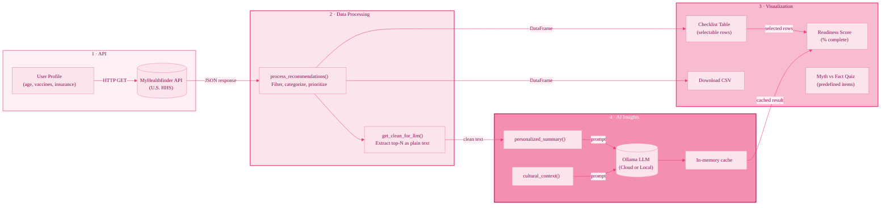

# Zena

**Healthcare in the U.S. explained without the confusion.**

Zena is an interactive Shiny web application for first-generation and international female students to understand preventive healthcare in the United States. It uses the MyHealthfinder API for official recommendations and Ollama (Cloud or local) for text simplification, cultural context, and personalized summaries.

## Features

- **User inputs**: Age (16–60), country background, vaccination status (HPV, Tdap, Flu, MMR), insurance
- **Data processing**: Rule-based filtering, categorization (Vaccinations, Screenings, Preventive Visits, Lifestyle), priority assignment
- **Ollama integration**: Personalized summary, cultural context, Myth vs Fact (cached for efficiency)
- **Pink theme UI**: Flip cards, preventive readiness score, downloadable checklist

## Project Overview

| | |
|---|---|
| **Topic** | Women's Health for First-Gen / International Students |
| **API** | [MyHealthfinder API](https://odphp.health.gov/our-work/national-health-initiatives/health-literacy/consumer-health-content/free-web-content/apis-developers/api-content) (U.S. HHS) |
| **Stack** | Python, Shiny for Python, pandas, matplotlib |

## Quick Start

```bash
# 1. Create venv and install
python -m venv venv
source venv/bin/activate   # Windows: venv\Scripts\activate
pip install -r requirements.txt

# 2. Copy .env.example to .env and add your OLLAMA_API_KEY (or use local Ollama)
cp .env.example .env

# 3. Run app
shiny run --reload app.py
```

## API Keys & AI

- **`.env`** – Copy `.env.example` to `.env` and add `OLLAMA_API_KEY`. For Ollama Cloud, also set `OLLAMA_MODEL=gpt-oss:120b`.
- **MyHealthfinder** – No API key required (public HHS API).
- **Ollama Cloud** – Required for public hosting. Get a key at [ollama.com/settings/keys](https://ollama.com/settings/keys). Use `gpt-oss:120b` as the model.

## Process Diagram



## Assignment Components

- **API Integration**: MyHealthfinder – personalized preventive care recommendations
- **Key Statistics**: Value boxes (recommendations, topics, categories)
- **AI Insights**: Ollama (local LLM) for plain-language summaries (optional)
- **UI**: Python Shiny, reactive text, value boxes
- **Visualizations**: Bar chart, pie chart, recommendations table, topics table


